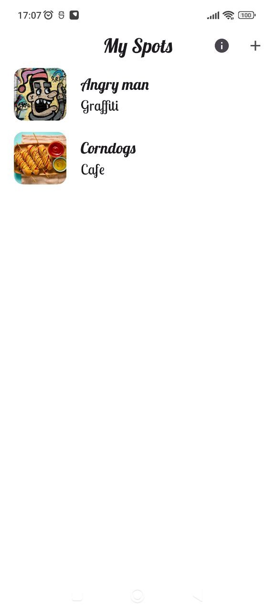
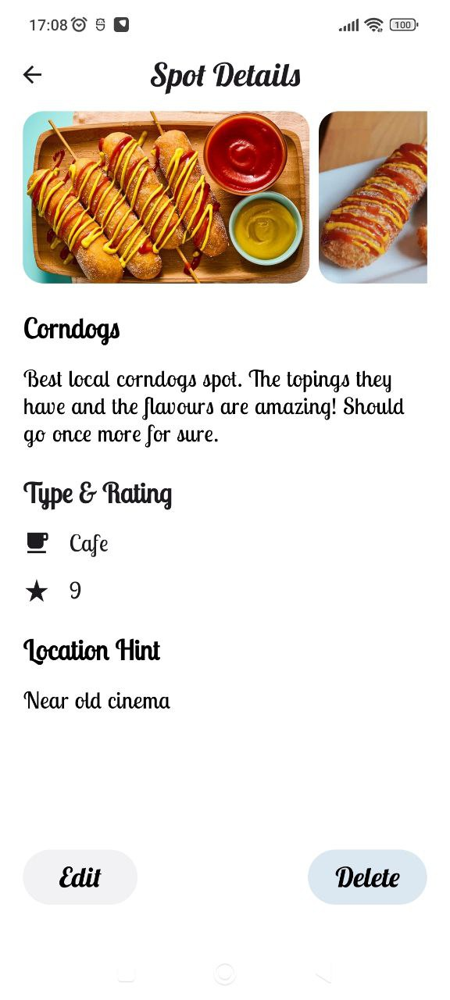
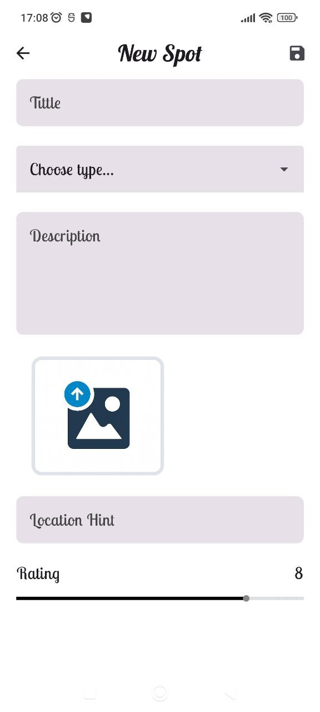
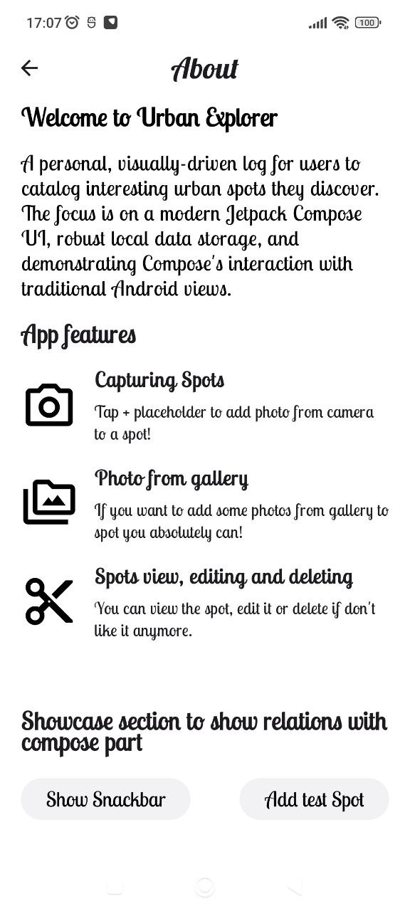

# Urban Explorer 🗺️

A small but production-style Android app to catalog interesting urban spots with photos and notes. Built to demonstrate **modern Android** with a **clean, testable architecture**. The focus is on a modern Jetpack Compose UI, robust local data storage, and demonstrating Compose's interaction with traditional Android views.


## 🎯 Why this project

I built Urban Explorer as a **showcase** of how I approach Android apps:

* Compose-first UI with **XML screens** integrated
* **MVVM + Clean Architecture**
* Clear **module boundaries** (domain/data/presentation)
* **Dependency Injection** for testability
* Room-backed offline storage with **Flows**
* **Unit + UI testing** with repository fakes
* **Scalability** in mind

## ✨ Features

* Create, view, edit, and delete “spots”
* Attach and display photos for a spot
* Local db storage (Room)
* Colors, themes, and fonts interoperability for Compose + XML use
* Creating test spots from XML screen (about)


## 🔍 Notes & Trade-offs

* Keep in mind that development was focused on highlighting structure, not features.
* Compose-first UI with XML interop to reflect real-world migration paths.
* Fakes in tests demonstrate UI behavior without a backend.


> **Screenshots**
>
> | Spots List                                     | Spot Details                                       | New Spot                               | About Screen                                     |                    
> | --------------------------------------------- | --------------------------------------------- | --------------------------------------------- | --------------------------------------------- |
> |  |  |  | |


## 🏗️ Architecture

* **Presentation**: Jetpack Compose screens, `ViewModel`s (MVVM), immutable `UiState` via `StateFlow`, reusable components, UI models + providers.
* **Domain**: Use cases, models, repository interfaces, pure Kotlin.
* **Data**: Repositories implementations, Room DAOs, mappers, one source of truth.

```
:app
:core
:data
:di
:domain
:presentation
:testing
```

## 🧰 Tech Stack

* **Kotlin**, Coroutines, Flow
* **Jetpack Compose**, Navigation-Compose
* **Fragments, XML, Recycler Views, Compose Views** to show XML integrity viability
* **Hilt** for DI
* **Room** for local storage
* **Coil** for images, AndroidX libraries
* **JUnit / Truth / Turbine** for tests

## 📝 License

[Apache-2.0](LICENSE)

```
Copyright 2025 Harbulinskyi Dmytro

   Licensed under the Apache License, Version 2.0 (the "License");
   you may not use this file except in compliance with the License.
   You may obtain a copy of the License at

       http://www.apache.org/licenses/LICENSE-2.0

   Unless required by applicable law or agreed to in writing, software
   distributed under the License is distributed on an "AS IS" BASIS,
   WITHOUT WARRANTIES OR CONDITIONS OF ANY KIND, either express or implied.
   See the License for the specific language governing permissions and
   limitations under the License.
```
